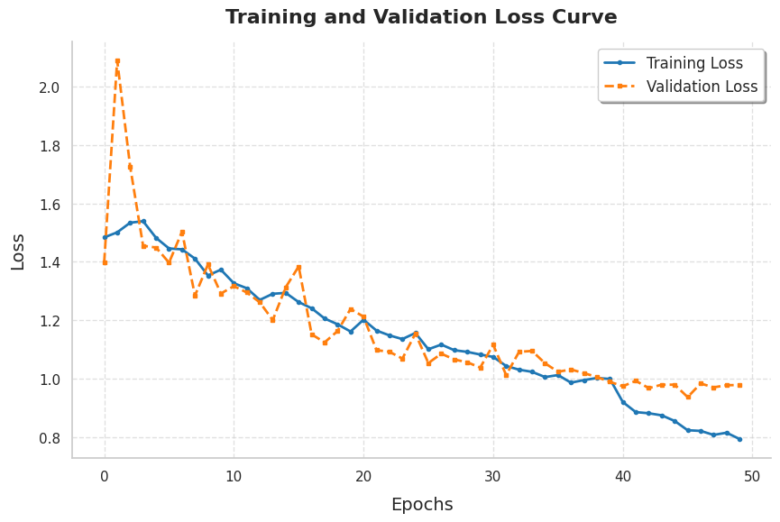
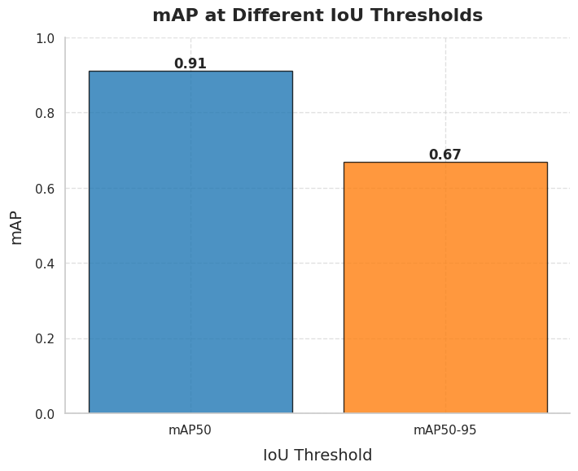
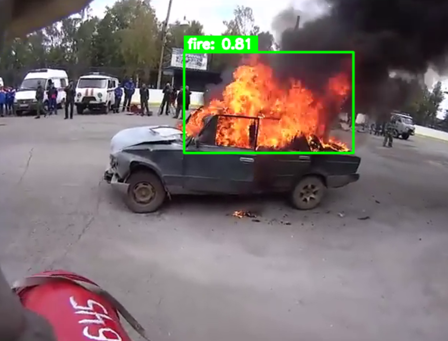

# Fire Detection 🔥

This repository contains a fire detection system using YOLOv8, a powerful real-time object detection algorithm.

## Overview

YOLO (You Only Look Once) is a pre-trained model capable of detecting up to 80 classes without additional training. However, since fire detection is not among these default classes, we fine-tuned the YOLOv8n model specifically for this task using a dedicated fire detection dataset.

## Architecture


- YOLO architecture image

For our implementation, we used the YOLOv8n model, which offers a good balance between speed and accuracy. The training was performed on Kaggle using a P100 GPU, with a total training time of approximately 14 minutes.

### Training Results




## Dataset

We used the [Fire Detection dataset](https://www.kaggle.com/datasets/metinmekiabullrahman/fire-detection) from Kaggle, which contains the following distribution:

- Training set: 1004 images with corresponding labels
- Validation set: 754 images with corresponding labels
- Test set: 751 images with corresponding labels

The dataset is configured with a data.yaml file that defines the class structure.


## Usage

After training, we saved the model weights and created an application (`app.py`) that can load a video and perform inference on each frame to detect fire.

To run the application:

```bash
cd src
python app.py
```
## Demo



## License

[Apache License](LICENSE)

## Acknowledgements

- [Ultralytics YOLOv8](https://github.com/ultralytics/ultralytics)
- [Fire Detection Dataset](https://www.kaggle.com/datasets/metinmekiabullrahman/fire-detection)